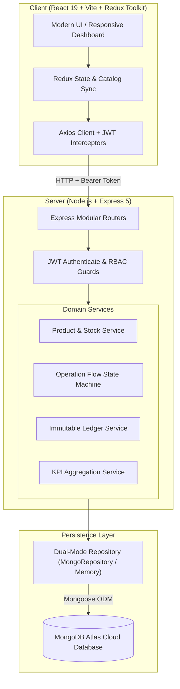

# 📦 StockSense — Modern Inventory Management System (IMS)

[](https://github.com)
[](https://mongodb.com)
[-brightgreen.svg?style=for-the-badge)](https://github.com)
[](LICENSE)

> **StockSense** is an enterprise-grade, Odoo-inspired Inventory Management System built with **React, Redux Toolkit, Vite, Node.js, Express, and MongoDB Atlas**. Engineered with strict double-entry ledger tracking, real-time multi-location availability, automated document lifecycles, and role-based access control (RBAC).

---

## ✨ Key Highlights & Features

<table>
  <tr>
    <td width="50%">
      <h3>🏢 Multi-Warehouse & Locations</h3>
      <ul>
        <li>Hierarchical storage mapping: <code>Warehouse &rarr; Locations &rarr; Racks/Bins</code>.</li>
        <li>Automatic per-location stock aggregation (<b>On Hand</b> vs <b>Free to Use</b>).</li>
        <li>Location validation prevents orphaned active stock items.</li>
      </ul>
    </td>
    <td width="50%">
      <h3>🔄 Complete Operations Engine</h3>
      <ul>
        <li><b>Receipts</b>: <code>Draft &rarr; Ready &rarr; Done</code> (Auto-Print enabled).</li>
        <li><b>Deliveries</b>: <code>Draft &rarr; Waiting &rarr; Ready &rarr; Done</code> with automated stock shortage alerts.</li>
        <li><b>Internal Transfers</b>: Two-legged atomic stock conservation.</li>
        <li><b>Stock Adjustments</b>: Signed delta audit ledger logging.</li>
      </ul>
    </td>
  </tr>
  <tr>
    <td width="50%">
      <h3>📊 Real-Time Analytics & Dashboard</h3>
      <ul>
        <li>Instant KPI metrics: Total Products, Low Stock, Out of Stock, Inventory Value.</li>
        <li>Interactive stock distribution donut chart & activity log.</li>
        <li>Operations pipeline with schedule tracking (Late / Scheduled / Waiting).</li>
      </ul>
    </td>
    <td width="50%">
      <h3>🔐 Enterprise Security & RBAC</h3>
      <ul>
        <li>JWT-authenticated sessions with cryptographic verification.</li>
        <li>Granular Roles: <b>Inventory Manager</b> vs <b>Warehouse Staff</b>.</li>
        <li>3-step secure OTP password reset with token expiry & session invalidation.</li>
      </ul>
    </td>
  </tr>
</table>

---

## 🏗️ System Architecture



---

## ⚡ Quick Start

### 1. Prerequisites
- **Node.js**: `v20.0.0` or higher (Node 22+ recommended)
- **NPM**: `v10.0.0+`
- **MongoDB Atlas** (or local MongoDB instance)

### 2. Installation & Setup
Clone the repository and install all dependencies:

```bash
# Clone the repository
git clone https://github.com/your-username/stocksense.git
cd stocksense

# Install all root, client, and server dependencies
npm run setup
```

### 3. Configure Environment Variables
Create a `.env` file in the `server/` directory:

```env
PORT=4000
CLIENT_ORIGIN=http://127.0.0.1:5173
MONGODB_URI=mongodb+srv://<username>:<password>@cluster0.mongodb.net/stocksense
```

### 4. Launch Development Servers
Start both the Backend API and Frontend Web Client with a single command:

```bash
npm run dev
```

* **Frontend Web App**: [`http://127.0.0.1:5173`](http://127.0.0.1:5173)
* **Backend API Health**: [`http://127.0.0.1:4000/api/health`](http://127.0.0.1:4000/api/health)

---

## 🔑 Default Credentials

| Role | Login ID | Password | Access Scope |
| :--- | :--- | :--- | :--- |
| **Inventory Manager** | `admin01` | `StockSense@123` | **Full Access** (Warehouses, Team RBAC, Product Creation, Full Operations) |
| **Warehouse Staff** | `staff01` | `StockSense@123` | **Operations Access** (Movements, Pick/Pack, Stock Inspection) |

---

## 📋 Business Flow & Operational Rules

### 1. Automated Reference Generation
Every document is uniquely referenced following Odoo conventions:
$$\text{Reference} = \langle\text{Warehouse ShortCode}\rangle / \langle\text{Operation Prefix}\rangle / \langle\text{Sequence Number}\rangle$$

* **Receipts (`IN`)**: `WH/IN/0001`
* **Deliveries (`OUT`)**: `WH/OUT/0001`
* **Internal Transfers (`INT`)**: `WH/INT/0001`
* **Adjustments (`ADJ`)**: `WH/ADJ/0001`

### 2. State Machine Flows

```
[ Receipts / Transfers / Adjustments ]
  Draft ──( Click "TODO" )──> Ready ──( Click "Validate" )──> Done (Print Enabled)
    │                           │
    └──( Cancel )───────────────┴──( Cancel )──> Canceled [Terminal]

[ Delivery Orders ]
  Draft ──( Click "TODO" )──> [ Availability Check ]
                                   │
             ┌─────────────────────┴─────────────────────┐
             ▼ (Stock Available)                         ▼ (Stock Shortage)
           Ready                                      Waiting (Red Alert)
             │                                           │
             │                                           │ (Click "Check Availability")
             │                                           ▼
             └───────────────────────────────────────> Ready ──( Validate )──> Done
```

### 3. Double-Entry Move History (Ledger)
Every verified operation creates atomic, immutable ledger rows:
- 🟢 **Green Rows (`IN`)**: Positive quantity received or returned into warehouse location.
- 🔴 **Red Rows (`OUT`)**: Negative quantity dispatched or shipped to customers.
- Dual-toggle support for **List View** and **Kanban View** grouped by status.

---

## 📡 API Reference

All protected endpoints require an `Authorization: Bearer <jwt_token>` header.

### Authentication & Team
| Method | Endpoint | Description |
| :--- | :--- | :--- |
| `POST` | `/api/auth/login` | Authenticate user & return JWT token |
| `POST` | `/api/auth/signup` | Register new user (defaults to Staff) |
| `POST` | `/api/auth/forgot-password` | Initiate OTP reset flow |
| `POST` | `/api/auth/verify-otp` | Verify 6-digit one-time code |
| `POST` | `/api/auth/reset-password` | Complete password reset |
| `GET` | `/api/auth/me` | Fetch active user session |
| `GET` | `/api/team` | List team members *(Manager only)* |
| `PATCH` | `/api/team/:id/role` | Update user permissions *(Manager only)* |

### Products & Inventory
| Method | Endpoint | Description |
| :--- | :--- | :--- |
| `GET` | `/api/products` | List all products with location stock aggregation |
| `POST` | `/api/products` | Create new product *(Manager only)* |
| `GET` | `/api/products/:id` | Fetch product details & location breakdown |
| `PUT` | `/api/products/:id` | Update product metadata *(Manager only)* |
| `DELETE`| `/api/products/:id` | Remove product & location records *(Manager only)* |
| `POST` | `/api/products/:id/stock` | Perform inline physical stock count adjustment |

### Operations & Movements
| Method | Endpoint | Description |
| :--- | :--- | :--- |
| `GET` | `/api/receipts` | List all goods receipt documents |
| `GET` | `/api/deliveries` | List customer delivery orders |
| `GET` | `/api/transfers` | List internal warehouse transfers |
| `GET` | `/api/adjustments` | List inventory physical adjustments |
| `POST` | `/api/:module/:id/transition` | Execute state action (`todo`, `check`, `validate`, `cancel`) |
| `GET` | `/api/ledger` | Fetch complete audit move history |
| `GET` | `/api/dashboard` | Get real-time KPIs, overdue counts, and chart distributions |

---

## 🧪 Testing & Verification

StockSense includes an integration test suite verifying atomic transactions, state guards, and error rollbacks:

```bash
# Run server test suite
npm test --prefix server
```

```
✔ HTTP routes authenticate, create, transition and report inventory (411ms)
✔ receipt transitions increase stock exactly once and write IN ledger (2ms)
✔ delivery waits for stock, rechecks availability, then decreases stock (1.5ms)
✔ ready delivery rechecks stock at validation and does not partially apply (2ms)
✔ transfer conserves global stock and records OUT + IN per product (1ms)
✔ adjustment overwrites physical count, logs signed delta, allows zero (1ms)
✔ reject duplicate lines, negative quantities, invalid locations (1ms)
✔ cancellation and document-type flows remain separate (1ms)
✔ reference counters separate operations and warehouses (1ms)
✔ manual stock change and initial stock creation roll back on failure (1.5ms)
✔ dashboard uses date boundaries and applies filters (0.5ms)
✔ auth matches exact login error, unique IDs/email/password, complexity (100ms)
✔ OTP resets consume token and invalidate old sessions (77ms)

Tests:  13 passed, 13 total
Suites: 0 failed, 13 passed
Time:   0.98s
```

---

## 📁 Repository Structure

```
odoo-Jalandhar/
├── client/                     # React 19 Frontend Web Application
│   ├── src/
│   │   ├── api/                # Axios client & request activity tracking
│   │   ├── components/         # Reusable UI, Layout, Product Thumbnails, Skeleton loaders
│   │   ├── config/             # Module definitions & RBAC permission helpers
│   │   ├── hooks/              # Custom data-fetching hooks (useApi)
│   │   ├── pages/              # Dashboard, Products, Documents, Ledger, Settings, Team
│   │   ├── store/              # Redux Toolkit root store & slices
│   │   ├── styles.css          # Core design tokens, dark/light contrast, responsive CSS
│   │   └── workflow.css        # Loading animations, shimmer cards, progress bars
│   └── vite.config.js          # Vite development server & reverse proxy
│
├── server/                     # Express.js REST API Backend
│   ├── src/
│   │   ├── controllers/        # Express HTTP controllers (Auth, Products, Operations, Ledger)
│   │   ├── domain/             # Business rules, state transition flows & permissions
│   │   ├── middleware/         # JWT authentication & role-based authorization guards
│   │   ├── models/             # Mongoose Schemas (User, Product, Document, Ledger, Warehouse)
│   │   ├── repositories/       # Dual Repository Pattern (MongoRepository / MemoryRepository)
│   │   ├── routes/             # Isolated modular REST routers
│   │   ├── services/           # Core domain logic (Stock mutation, Reference counter, Dashboard)
│   │   └── db.js               # MongoDB Atlas connection & auto-seeder
│   └── test/                   # End-to-end integration test suite
│
├── docs/                       # Requirements, verification, and architecture documentation
└── package.json                # Root orchestration & scripts
```

---

## 👨‍💻 Team & Git Workflow

All feature work is divided into 3 independent, conflict-free workstreams:
- **`feature/auth-dashboard`**: Auth, Profile, Team RBAC, and Dashboard Analytics.
- **`feature/products-stock`**: Catalog Management, Stock by Location, and Move History.
- **`feature/operations`**: Receipts, Deliveries, Transfers, and Mutation Services.

---

<div align="center">
  <sub>Built with ❤️ for High-Performance Inventory Operations. Designed with Odoo wireframe precision.</sub>
</div>
